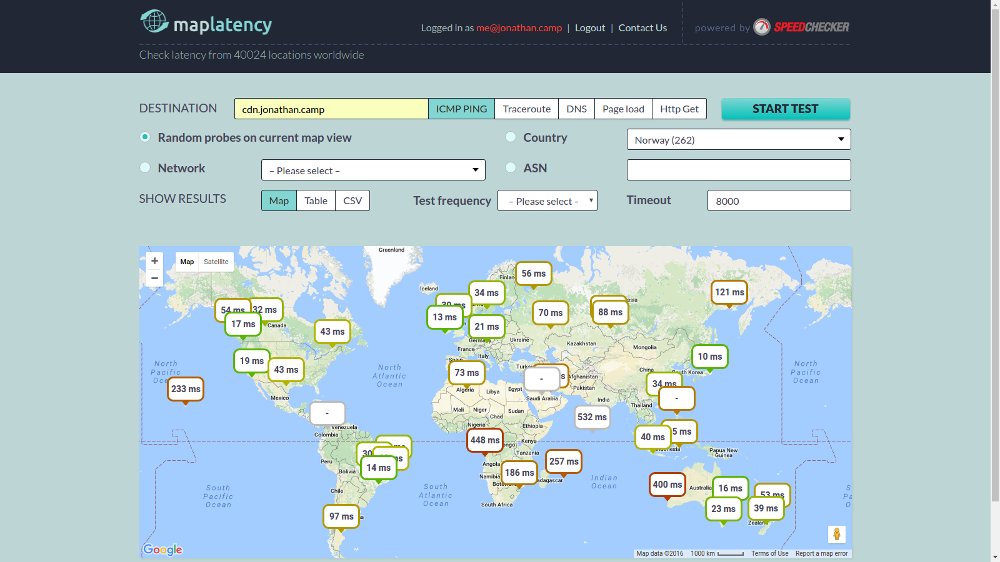

# multiregion-terraform
Example multi-region AWS Terraform application

**TL;DR**: launch 26 EC2 instances in 11 regions with a single terraform command

Amazon has 13 data centers with 35 availability zones spread around the world. This Terraform application launches EC2 instances in every possible zone, and ties them together into a single domain name that routes pings to the closest instance.

## Features

* Single `main.tf` with a module instance for each Amazon's [11 regions][1]
* Creates an EC2 instance in every region and availability zone
* Creates a Route 53 record with [latency based routing][2] to all EC2 instances
* All instances allow ICMP Echo Request (ping) from `0.0.0.0/0`

### Latency Map
Note the lower latency when the ping souce in near to one of Amazon's datacenters:
[](map_latency.png)

### Terraform Dependency Graph
[](graph.png)

## How-to

Notes:

* **IMPORTANT**: edit [cdn/variables.tf](cdn/variables.tf) and set `r53_zone_id` and `r53_domain_name`
* tested with Terraform v0.7.4
* override the Amazon credential [profile settings][3] by setting `AWS_PROFILE=blah`
* comment out regions in [main.tf](main.tf) to test a smaller deployment
* Terraform types used: aws_ami, aws_vpc, aws_internet_gateway, aws_subnet, aws_route_table, aws_route_table_association, aws_security_group, aws_instance, and aws_route53_record
* regions and availability zones were valid at commit time. If Terraform returns an Amazon error complaining about errors launching an instance, edit `az` in [cdn/module.tf](cdn/module.tf)
    ```
    * aws_instance.server.0: Error launching source instance: Unsupported: Your requested instance type (t2.nano) is not supported in your requested Availability Zone (ap-southeast-2a). Please retry your request by not specifying an Availability Zone or choosing ap-southeast-2c, ap-southeast-2b.
    status code: 400, request id: 1c377a9d-9a21-4f33-9def-43faf480d205
    ```

```
$ terraform get
Get file:///home/jonathan/src/multiregion-terraform/cdn
Get file:///home/jonathan/src/multiregion-terraform/cdn
...

$ AWS_PROFILE=personal terraform plan
module.cdn-us-east-1.data.aws_ami.default: Refreshing state...
module.cdn-us-west-1.data.aws_ami.default: Refreshing state...
...
Plan: 32 to add, 0 to change, 0 to destroy.

# replace 'personal' with the name of your AWS profile in ~/.aws/crendentials or leave blank for 'default'
$ AWS_PROFILE=personal terraform apply
module.cdn-us-west-1.data.aws_ami.default: Refreshing state...
module.cdn-us-east-1.data.aws_ami.default: Refreshing state...
...
Apply complete! Resources: 32 added, 0 changed, 0 destroyed.

$ terraform output -module=cdn-us-east-1
servers = [
    54.198.56.163,
    52.90.73.117,
    52.91.127.142,
    52.207.230.71
]

$ dig +short @8.8.8.8 cdn.jonathan.camp
52.207.230.71
52.90.73.117
52.91.127.142
54.198.56.163
```

[1]: https://docs.aws.amazon.com/AWSEC2/latest/UserGuide/using-regions-availability-zones.html#concepts-available-regions
[2]: https://docs.aws.amazon.com/Route53/latest/DeveloperGuide/routing-policy.html#routing-policy-latency
[3]: https://www.terraform.io/docs/providers/aws/#shared-credentials-file
